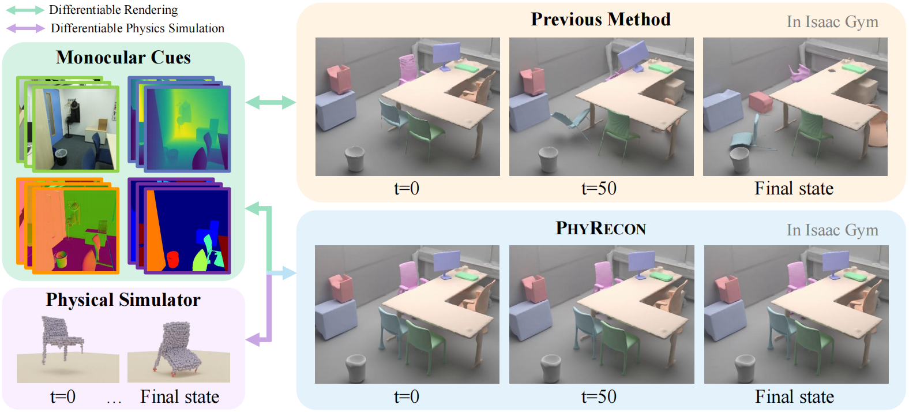

<h2 align="center">
  <b>PhyRecon: Physically Plausible Neural Scene Reconstruction</b>

  <b><i>NeurIPS 2024 </i></b>
</h2>

<p align="center">
    <a href='https://arxiv.org/abs/2404.16666'>
      
    </a>
    <a href='https://www.youtube.com/watch?v=ZXe3bGJiL_k'>
      
    </a>
    <a href='https://phyrecon.github.io/'>
      
    </a>
</p>

<p align="center">
    <a href="https://dali-jack.github.io/Junfeng-Ni/">Junfeng Ni*</a>,
    <a href="https://yixchen.github.io/">Yixin Chen*</a>,
    <a href="">Bohan Jing</a>,
    <a href="https://pku.ai/author/nan-jiang/">Nan Jiang</a>,
    <a href="https://binwangbfa.github.io/">Bin Wang</a>,
    <br>
    <a href="https://daibopku.github.io/daibo/">Bo Dai</a>,
    <a href="https://xiaoyao-li.github.io/">Puhao Li</a>,
    <a href="https://yzhu.io/">Yixin Zhu</a>,
    <a href="https://zhusongchun.net/">Song-Chun Zhu</a>,
    <a href="https://siyuanhuang.com/">Siyuan Huang</a>
</p>

<p align="center">
    
</p>

PhyRecon harnesses both differentiable rendering and differentiable physics simulation to achieve physically plausible scene reconstruction from multi-view images.

## News

-  [2025-3-20] Our follow-up work, **DP-Recon**, which integrates generative priors into decompositional neural scene reconstruction, is now out! Check it out [here](https://dp-recon.github.io/)!
- [2025/1/14] Code is released. For more information, please visit our [project page](https://phyrecon.github.io/)!
- [2025/1/14] Our [Differentiable-Rigid-Body-Simulator](https://github.com/bigai-ai/differentiable-rigid-body-simulator) is open sourced!

## Installation
```bash
conda create -n phyrecon python=3.9
conda activate phyrecon
pip install torch==2.0.1 torchvision==0.15.2 --index-url https://download.pytorch.org/whl/cu118
pip install -r requirements.txt
```

## Data
Please download the preprocessed [data](https://drive.google.com/drive/folders/1gdYiCg9VFlFD5dLuJQz2j90UB80oohc2?usp=drive_link) and unzip in the `data` folder. The resulting folder structure should be:
```
└── PhyRecon
  └── data
    ├── replica
        ├── scan ...
    ├── scannet
        ├── scan ...
    ├── scannetpp
        ├── scan ...
```
Since the full dataset is quite large, we use the `scannetpp/scan1` as an example scene. Please download this scene [here](https://drive.google.com/file/d/1rUXLZO5c2LFHapN7TYQPaikrihHYzeHC/view?usp=drive_link) and ensure it is placed under `data/scannetpp` following the folder structure.

## Training
```bash
cd code
torchrun training/exp_runner.py --conf CONFIG  --scan_id SCAN_ID
# CONFIG is the config file in code/confs, and SCAN_ID is the id of the scene to reconstruct.
### for the example scene from scannetpp
# torchrun training/exp_runner.py --conf confs/scannetpp_phyrecon_grid.conf --scan_id 1
### By default, training logs are saved using wandb. If you prefer to use TensorBoard, you can set the '--none_wandb'. 
```

## Evaluation
### 1. Reconstruction
```bash
# evaluate total scene
python eval/eval_scene_recon.py --dataset_type DATASET     # DATASET could be 'scannetpp', 'scannet' and 'replica'
# evaluate each object
python eval/eval_object_recon.py --dataset_type DATASET
```

### 2. Physical Stability
First, install Issac Gym by following the [installation tutorial](https://docs.robotsfan.com/isaacgym/install.html). 
Once installed, you can evaluate object stability using the following command:
```bash
# evaluate stability
python eval/eval_stable_ratio.py --dataset_type DATASET
### If you want to enable visualization and interact with the window, please set `--vis` flag.
### Issac Gym will load the VHACD cache for the same object, 
### If you need to evaluate the stable ratio for the same dataset and scene multiple times, please set the `--test_idx` according to the number of tests you are running.
```
### 3. Performance
The performance of PhyRecon suffers from some instability and randomness due to the following reasons:
* The gap between the particle-based simulator used in our method and the mesh-based simulator (Issac Gym) used for stability evaluation.
* The small floaters of the reconstructed mesh may greatly impact the results.
* Some objects lack suitable collision points due to insufficient observations.

To mitigate the impact of instability, we rerun our method three times and report the mean and standard deviation, as shown in the table below. The differences between these results and those reported in the paper stem from the following:
* The baseline methods, ObjectSDF++ and RICO, fail to reconstruct certain objects during training, which causes some objects to be missing. In this paper, we restricted our evaluation to objects that appear across all methods. Our reproduced results included all objects reconstructed using our method.
* For the stability evaluation in the paper, we used the reconstructed backgrounds, which are more suitable for reconstructed objects but require significant manual effort. Instead, we provided GT backgrounds for all the scenes in the dataset for more convenient evaluation in the future.

Our reconstructed results are available [here](https://drive.google.com/file/d/19nFdVX9wcPKXyhFHlPwgvtjYPTrDDzyR/view?usp=drive_link).

<table>
  <thead>
    <tr>
      <th rowspan="3" colspan="2">Dataset</th>
      <th colspan="3">Scene Metrics</th>
      <th colspan="3">Object Metrics</th>
      <th rowspan="1">Stable Metric</th>
    </tr>
    <tr>
      <th>CD(↓)</th>
      <th>F-Score(↑)</th>
      <th>NC(↑)</th>
      <th>CD(↓)</th>
      <th>F-Score(↑)</th>
      <th>NC(↑)</th>
      <th>SR(↑)</th>
    </tr>
  </thead>
  <tbody>
    <tr>
      <td rowspan="2">ScanNet++</td>
      <td>In Paper</td>
      <td>3.34</td>
      <td>81.53</td>
      <td>90.10</td>
      <td>3.28</td>
      <td>87.21</td>
      <td>86.16</td>
      <td>78.16</td>
    </tr>
    <tr>
      <td>Reproduced</td>
      <td>3.66±0.06</td>
      <td>80.87±0.92</td>
      <td>88.24±0.45</td>
      <td>2.92±0.11</td>
      <td>88.07±0.34</td>
      <td>82.98±0.58</td>
      <td>71.84±1.46</td>
    </tr>
    <tr>
      <td rowspan="2">ScanNet</td>
      <td>In Paper</td>
      <td>8.34</td>
      <td>63.01</td>
      <td>86.57</td>
      <td>7.92</td>
      <td>75.54</td>
      <td>82.54</td>
      <td>70.31</td>
    </tr>
    <tr>
      <td>Reproduced</td>
      <td>8.56±0.25</td>
      <td>58.22±3.89</td>
      <td>83.29±1.02</td>
      <td>5.55±0.34</td>
      <td>71.43±2.18</td>
      <td>80.28±1.18</td>
      <td>57.79±3.99</td>
    </tr>
    <tr>
      <td rowspan="2">Replica</td>
      <td>In Paper</td>
      <td>3.68</td>
      <td>85.61</td>
      <td>89.45</td>
      <td>3.86</td>
      <td>81.30</td>
      <td>84.91</td>
      <td>77.63</td>
    </tr>
    <tr>
      <td>Reproduced</td>
      <td>3.66±0.06</td>
      <td>83.13±1.71</td>
      <td>92.06±1.57</td>
      <td>3.45±0.19</td>
      <td>85.91±1.47</td>
      <td>87.29±1.03</td>
      <td>66.69±3.20</td>
    </tr>
  </tbody>
</table>


## Acknowledgements
Some codes are borrowed from [MonoSDF](https://github.com/autonomousvision/monosdf), [RICO](https://github.com/kyleleey/RICO) and [ObjectSDF++](https://github.com/QianyiWu/objectsdf_plus). We thank all the authors for their great work. 

## Citation

```bibtex
@inproceedings{ni2024phyrecon,
  title={PhyRecon: Physically Plausible Neural Scene Reconstruction}, 
  author={Ni, Junfeng and Chen, Yixin and Jing, Bohan and Jiang, Nan and Wang, Bin and Dai, Bo and Li, Puhao and Zhu, Yixin and Zhu, Song-Chun and Huang, Siyuan},
  journal={Advances in Neural Information Processing Systems},
  year={2024}
}
```
