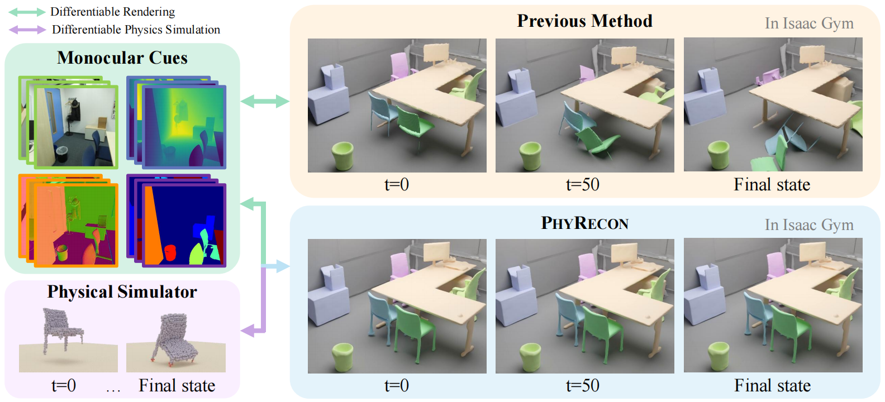
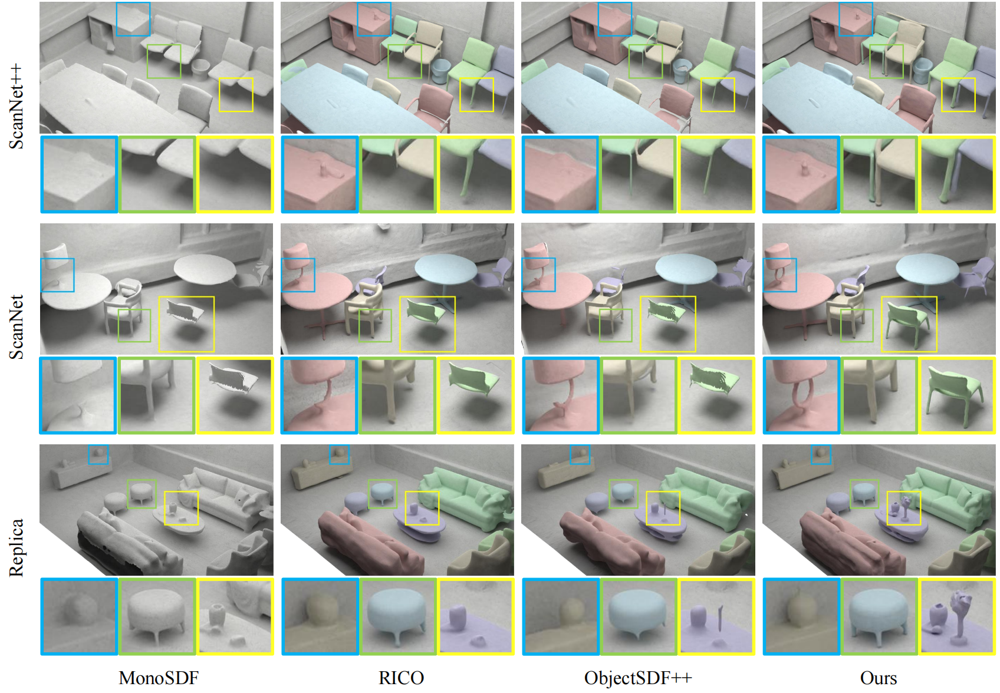

# PhyRecon: Physically Plausible Neural Scene Reconstruction

Official implementation of the paper *[PHYRECON: Physically Plausible Neural Scene Reconstruction](https://arxiv.org/abs/2404.16666)*.

Code will be released soon.

<p align="center">
    
</p>

<p align="center">
    
</p>

<p align="center">
    
</p>

## BibTeX

```bibtex
@misc{ni2024phyrecon,
      title={PhyRecon: Physically Plausible Neural Scene Reconstruction}, 
      author={Junfeng Ni and Yixin Chen and Bohan Jing and Nan Jiang and Bin Wang and Bo Dai and Yixin Zhu and Song-Chun Zhu and Siyuan Huang},
      year={2024},
      eprint={2404.16666},
      archivePrefix={arXiv},
      primaryClass={cs.CV}
}
```
